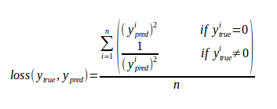

# Siamese LSTM for Text Classification

## Goal
Create model for text classification problems (including intent detection and sentiment analysis) that only requires a small amount of labeled data.

## Architecture
Uses a regression Siamese Recurrent Network \[[1](##references)\] that serves as the distance function for a k-Nearest Neighbor model.

The Siamese network learns to generate distance values for each pair of sentences within the corpus. A pair with the same label comes with a desired value of 0, while a pair with different labels comes with a very large arbitrary value.

The learned network is then used by a k-NN model using the training data. Evaluation is done on the k-NN with test data.

#### Siamese Model Diagram

#### Current configurations
- Embedding layer: uniform distributed 200-dimensional vectors
- Bidirectional LSTMs: 3 layer-pairs of size 1024, 512, 256. Activation: `tanh`
- Single-outpur LSTM: size 256. Activation: `sigmoid`
- Dense layer: size 128. Activation: `linear`
- Merge layer: Mean absolute difference
- Loss function: An experimental loss function where:

    

- Batch size: 50
- Dropout: 0.1
- L2 regularization: 0.03

## References
1. [Learning Text Similarity with Siamese Recurrent Networks](docs/W16-1617.pdf)
